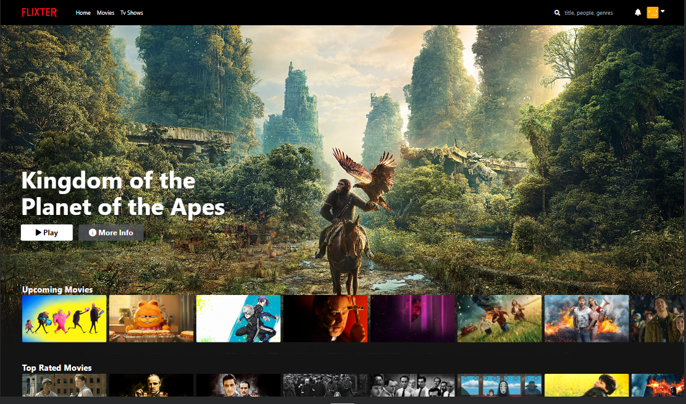

# Streaming Website Clone Project

## About
This project replicates the user interface of Netflix using react and tailwind. It is created as a learning exercise and to enhance the skills of the developer in front end development.

## How to use?
1. Clone the repo.

2. On terminal run: npm install

3. Then to run the app: npm run dev

## Purpose
- Learn and practice front-end web development.

- Gain hands-on experience with React and Tailwind.

- Understand the UI/UX.

## Technologies used 
- Front-end: React, Tailwind, The Movie Database API,

- Deployment: Vercel

## Disclaimer
This project is my front-end project to improve my skills as a full stack developer. This Netflix clone project is intended solely for educational purposes only and practice web development skills. Please note that this project is not affiliated with or endorsed by Netflix. All UI, icons, and logos are belong to the company and not mine, and it's fully learning purposes only.

